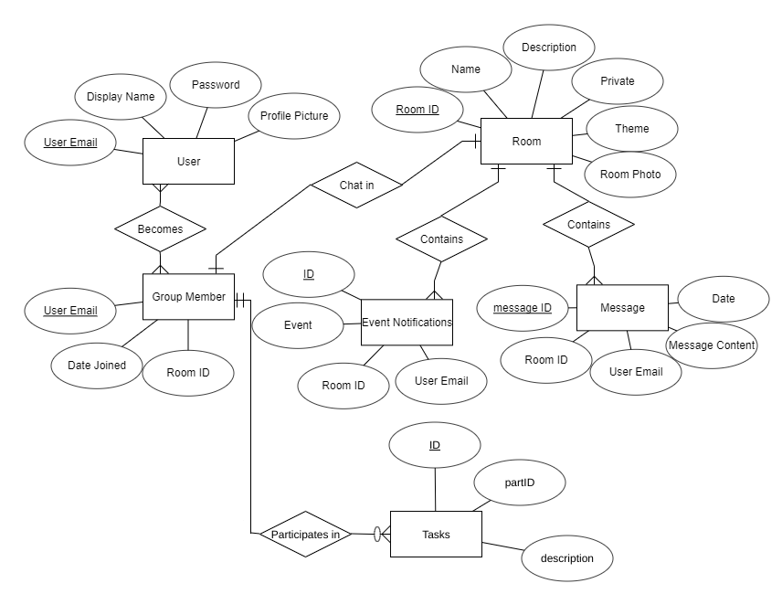

#  co-op
A social task managing app developed by Jimmy Byrne, Sam Chami, Sam Savini, and John Scott


##  App Description
co-op is a messaging app created for groups who aim to complete certain tasks and goals together as a group. Our aim is to combine a task managing app with a fun and easy to use message-based social platform. The goals of a user can be as diverse as they would like to make them, from losing weight to completing a group project. The app creates rooms for groups with certain goals, and enables message-based conversation between members. Any user can create their own tasks within their respective groups, and adjust the state of their task as time goes on. In this way, members can see the rate of progress for fellow users within the messaging group.


##  Setup
###  MacOS:
```
$ npm install
$ react-native run-ios
```

###  Windows:

```
$ npm install
```
Open Android Studio -> Android Device Manager -> React Native Configured Emulator
```
$ react-native run-android
```

###  Ubuntu:
```
$ npm install
```
Navigate to the android studio directory and run `studio.sh`:
```
$ cd android-studio/bin
$ ./studio.sh
```
Open Android Studio -> Android Device Manager -> React Native Configured Emulator
```
$ react-native run-android
```


##  Features
###  Messaging Service
A simple and easily understood messaging service brings members together to keep others in check on their progress. With such a transparent app design, users can encourage each other on their tasks, and offer assistance when they observe a fellow user who may be falling behind on their goals. Conversely, group members can celebrate fellow group members who manage to keep up with their tasks. The messaging service is also perfect for organizing events with a group like a study session, or a trip to the gym.

###  Task Creator
Within messaging groups, each individual user has the ability to create and adjust their own personal tasks. By selecting the 'create task' icon next to the messaging text box, a user is led to a page where they can personalize their own tasks. This includes providing a name for the task, and inputting a goal slider that can keep track of your progress. Once created, the task can be seen by each member of the respective group. All users of the app can see all tasks of every other user on their respective profile page.


##  Application Objectives
The Objective of co-op is to merge the world of a casual messaging app with the world of a task manager. We believe that through sharing one's tasks with other app users, he/she will be encouraged to continue his/her progress. The app is really meant to be what the user makes of it. For groups who seek serious weight loss or improved exercise, for example, conversation may revolve around selecting a time to meet to go on a bike ride. For groups who have tasks such as completing a project, the app may be used to share ideas on the project. For more casual users, tasks may not even be used, but the messaging service will drive the group conversation. By making such an open-ended application, our hope is that each user will make the app what they want it to be.


##  Application Materials
For the frontend of the app, our group used React Native, as well as React's libraries. There are two main reasons that we decided to use React Native to write our app in. The first is that we are all already familiar with Javascript which react native is based off of. The second reason is the platforms that React Native can run on. It can run on iOS and Android. It can also be more easily converted to a website than if we wrote it in Swift or Java. This app will have a database of messages, user profiles, and activity profiles, which will go well tie into our database project.

We chose to use PostgreSQL for our database because it seems like a good choice for group messenger type applications. This project has enough technical difficulty that it can span the course of one semester, and even two semesters if we want to make a website version or more features. At co-op's core, it is a glorified group messenger app. This means that we can focus on making the core of the app then expand outward with features as time allows. All of the group members can see potential uses for this app in their and their friends lives so it pertains to all of us, and hopefully to other users.


##  Dependencies
*  [Express](https://expressjs.com/en/starter/installing.html)
*  [React](https://reactjs.org/docs/getting-started.html)
*  [React Native](https://facebook.github.io/react-native/docs/getting-started)
*  [React Navigation](https://reactnavigation.org/docs/en/getting-started.html)
*  [Redux](https://redux.js.org/)
*  [Socket.IO](https://socket.io/docs/)


##  Application Structure
###  File Tree
*  android
*  ios
*  App.js
*  src
    *  client
       *  assets
       *  components
       *  config
       *  lib
       *  screens
    *  database
       *  models
    *  server
    *  store

###  Database Layout

