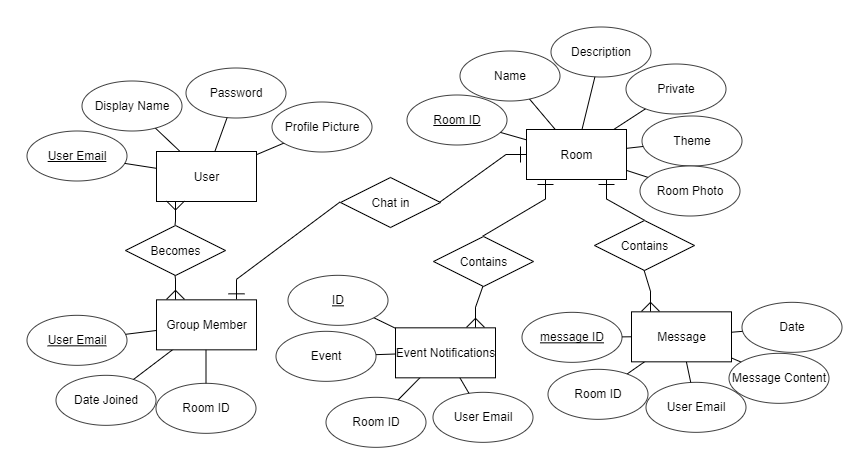

##  Preliminary Database Design Document

#####  Sam Chami, John Scott
#####  Introduction to Database Systems
#####  October 18th, 2018

1\.  Preliminary Database Design

1.1.  Project description, database engine used, potential users, maybe some other stuff

>  The project is to create and manage a database that can take care of data for the real-time group chat aspects of the BetterWe mobile app. We plan on using PostgreSQL to manage our database system since it is very stable, easy to manage cross-platform, and compatible with GUI and admin tools. Expected potential users are individuals or groups of friends looking to motivate themselves and keep track of their progress to a set goal. For example, a group of friends who agree to keep themselves accountable for their own individual weight loss goals.

1.2.  Data description, generally what type of data will be stored

>  Generally speaking, varChar will be used for the username, password, and message attributes of the tables and integers will be used for incrementing values such as message IDs. Since we will have to track the time certain messages are sent for ordering purposes, we will have to use PostgreSQL's DATE data type as well.

1.3.  At least five examples of the type of data your database will provide _to the user_

>  Possible examples of data provided to the user are user information, chat room information, messages, participants of a group chat, and event notifications. User information can include Email, display name, password, and a profile picture. A user's email will act as the primary key and will work to prevent the same user from signing up multiple times. Chat room information can include name, description, and possibly correspond with a color in order to easily differentiate different groups. Users will only be able to see other user's names and photos.

1.4.  A preliminary idea of the schema of the database including table descriptions and potential columns

>  This database is designed in hopes that a user will join multiple group chats. The user will have a table with his or her information and will be able to search and join groups. When they join a group, they will be placed into a participants table which will link them with a group table. The room table has information such as room name, room ID, room color theme, photo, and whether it is private or publicly available. The room consists of messages and chat notifications from two tables. These two tables are fairly similar with an ID, date sent, corresponding user and room ID, and date received.

1.5.  A complete preliminary Entity-Relationship Diagram [ERD] for the database [NOT hand-drawn, PLEASE!]

>  
