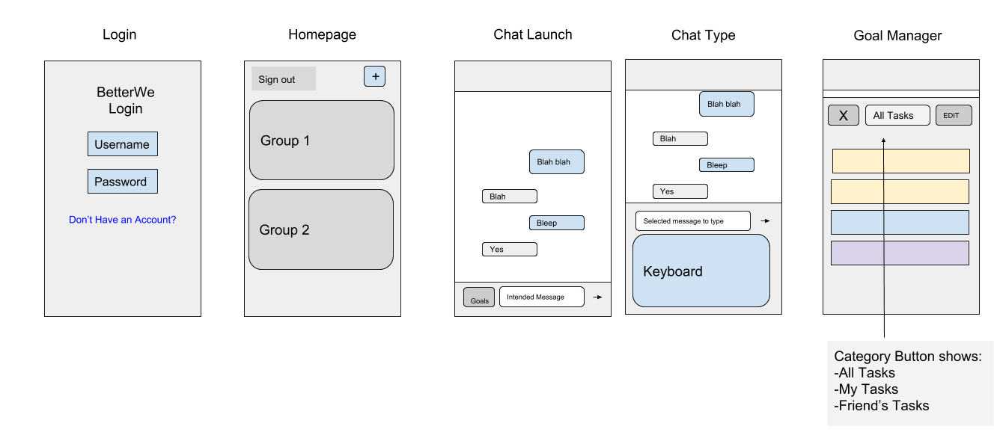

##  Requirements Specification

__What follows is an example of Requirements Specification structure__

1.1  __Introduction__

CoOp is a React Native application built to run on iOS and Android systems. It's purpose is to provide groups of people with a platform where they can keep each other accountable for activities they are doing together. Each user will make an account and be able to keep track of the groups that they are in. The main page for an activity will have the core functionality of a group messaging application. Added on to the messaging interface will be accountability features. Some of these features include checking in on your friend's progress, having your friend prove their check-ins, waging money for competing towards a goal, etc.

1.2  __CSCI Component Breakdown__ -- CSCI CoOp is composed of the following CSCs:

1.2.1 __GUI Client CSC__ -- The GUI Client will be a home screen displaying all of the user's groups. From there, the user can navigate to Chat pages, Goal Managers, and Group Finders.

1.2.1.1 __Client Login/Registration Screen CSU__ -- If the user is not logged in, they will be greeted with this screen to either log in to their account or create an account.

1.2.1.2 __Client Activities List Panel CSU__ -- This panel is where the user sees the groups that they are participating in.

1.2.1.2.1 __ActivityBanner module__ -- Each activity will have an icon or text associated with it so the user can easily identify their different groups.

1.2.1.3 __Client Current Activity Screen CSU__ -- This screen is where all of the actions happens. The user can talk to their group members and take advantage of accountability features.

A Simple Mockup of our current CSCI is shown below.

1.3  __Functional Requirements by CSC__

1.3.1  __Graphical User Interface__

1.3.1.1  The GUI subsystem shall display the current Goal page on startup if the user is in at least one group and they are already logged in.

1.3.1.2  The GUI subsystem shall display the login window in startup if the user has not logged in yet.

1.3.1.3  The GUI subsystem shall react to touch clicks.

1.3.1.4  The GUI subsystem shall include a menu bar at the top of the main window.

1.3.1.6  The GUI subsystem shall provide a messaging system similar to what the user is familiar with.

1.3.1.7  The GUI subsystem shall provide error checking on the text entry fields.

1.4  __Performance Requirements by CSC__

1.4.1  __Logging in or Registering__ -- Logging in and registering for a CoOp account should be integrated into Facebook or Google for a seamless login. The user should log in once and not have to worry about logging in ever again. The user should only see the registration/login menu if they are not logged in on that device.

1.4.2 __Creating a New Activity__ -- When creating an activity, the user will be able to select the accountability features that they want to use for their activity. It is also important to be able to invite friends to your group from your contacts.

1.4.3 __Selecting an Activity Banner__ -- To select an activity that has already been made, the user will click on the banner for that activity. The banner will be text with the title of the activity and/or a picture of the user's choosing.

1.4.4 __Locating Features to Use in Group Chat Environment__ -- At the base of the app is group messaging and communication. When on this page for an activity, the user will have to be able to easily locate the accountability features. They could be presented in a side bar or a bar like that of emoji options when you are typing.

1.5  __Project Environment Requirements__

1.5.1  __Development Environment Requirements__

1.5.1.1 __Android Development__

1.5.1.1.1 __Android Studio for Android Phone Emulator__

1.5.1.1.2 __Mac, Windows, or Linux System__

1.5.1.2 __iPhone Development__

1.5.1.2.1 __Xcode__

1.5.1.2.2 __An iPhone__

1.5.2  __Execution Environment Requirements__
